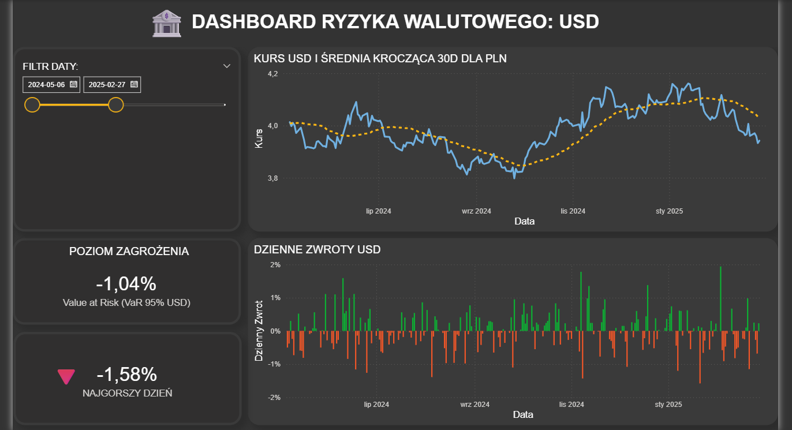
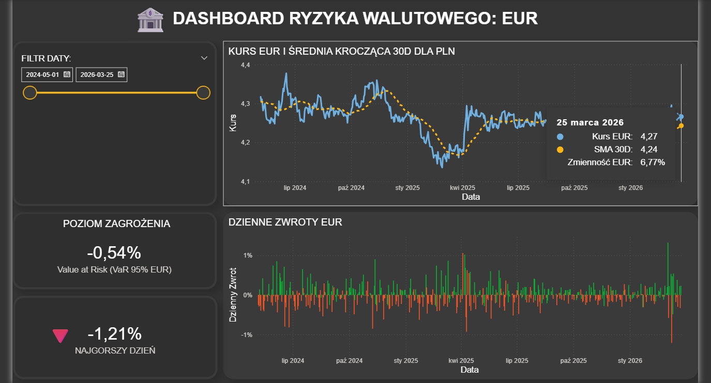
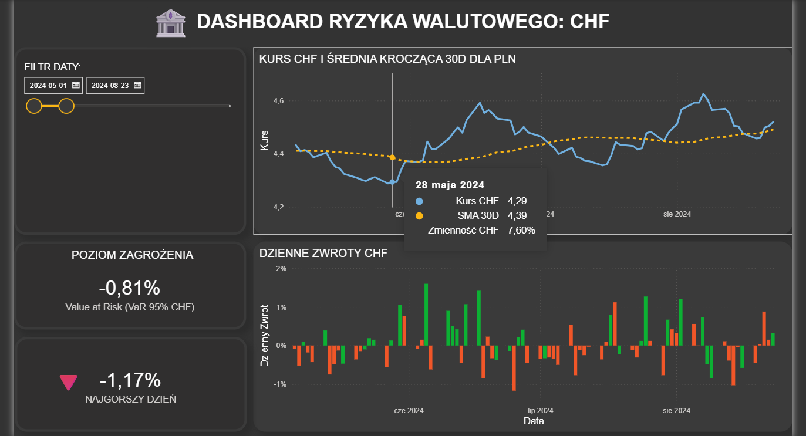

# 📈 Dashboard Ryzyka Walutowego (USD, EUR, CHF)

## 💬 O projekcie
Zrobiłem ten projekt, żeby w praktyce połączyć Pythona i Power BI na prawdziwych danych finansowych.

Raport odpowiada na pytanie: **„Biorąc pod uwagę to, co działo się na rynku przez ostatnie 30 dni, jak duży spadek kursu może nas jutro zaboleć?”**. 

## 🛠️ Użyte technologie:

1. **Python (przygotowanie danych):** Użycie bibliotek `pandas`, `numpy` i `yfinance`. Skrypt łączy się z API, pobiera historię kursów walut, a potem wylicza z nich to, co najważniejsze (np. VaR 95% i zmienność). Całość zapisuje do pliku .csv .
   
2. **Power BI (wizualizacja):** Tutaj wczytywane są przetworzone dane. Zbudowałem interaktywny dashboard, w którym suwak daty steruje całym raportem.
## 📊 Wykorzystane Metryki Finansowe
* **Poziom Zagrożenia (Rolling VaR 95%):** Kluczowy wskaźnik projektu. Oblicza Value at Risk (Wartość Zagrożoną) metodą historyczną na podstawie 30-dniowego okna kroczącego. Wskazuje maksymalny procentowy spadek kursu waluty z dnia na dzień z 95% pewnością. (Jeśli nie jest zaznaczony konkretny dzień, to automatycznie pokazuje wartość z ostatniego dnia danego okresu)
* **Średnia Krocząca 30D (SMA):** Wygładza te codzienne, nerwowe skoki kursu, żeby łatwiej było zobaczyć główny trend (czy waluta ogólnie drożeje, czy tanieje).
* **Najgorszy Dzień:** Wyciąga największą historyczną stratę z zaznaczonego okresu, żebyśmy mieli punkt odniesienia, jak źle potrafi być na rynku.

## 🚀 Jak uruchomić raport?
1. Należy uruchomić skrypt `analiza_ryzyka.py` w swoim środowisku (np. VS Code). Skrypt automatycznie pobierze dzisiejsze kursy zamknięcia i nadpisze plik z danymi.
2. Otworzyć plik `.pbix` w Power BI Desktop.
3. Kliknąć przycisk **Odśwież (Refresh)** na górnym pasku.
4. Dashboard automatycznie przesunie suwak daty i przeliczy poziom ryzyka na dzień dzisiejszy.

## 📸 Podgląd dashboardu

### dla Dolara:

### dla Euro:

### dla Franka Szwajcarskiego:

